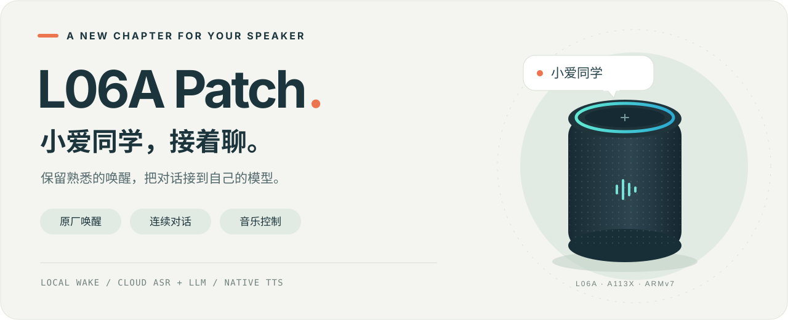
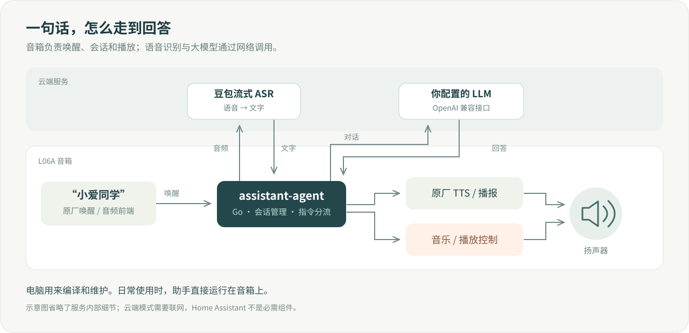

<div align="center">



# L06A Patch

给小爱音箱 L06A 接上可配置的语音助手。继续用熟悉的唤醒、扬声器和灯环。

[](https://github.com/xuys2025/L06A-patch/actions/workflows/check.yml)
[](assistant-agent/go.mod)


[上手编译](#-先把代码跑通) · [功能与进度](#-现在能做什么) · [开发文档](docs/DEVELOPMENT.md) · [更新记录](docs/build/DEVICE_CHANGE_LOG.md)

</div>

---

这台音箱的麦克风和扬声器还好好的，所以想继续折腾一下。

这个项目保留原厂“小爱同学”唤醒，让音箱上的 Go 程序接管后续会话：豆包负责语音识别，回答交给你配置的 LLM，再用原厂 TTS 播出来。音乐播放、网页配置和日常更新也放在这套程序里。

**日常使用不需要电脑常开，也不依赖 Home Assistant。** 目前的语音识别和大模型对话需要联网；这里没有在音箱上跑本地大模型。

## ✨ 现在能做什么

| 功能 | 目前情况 |
|---|---|
| 🎙️ 原厂唤醒 + 语音识别 | 保留六麦克风前端，接入豆包流式 ASR，已加入方言识别配置 |
| 💬 大模型对话 | 支持 OpenAI 兼容接口，地址、模型和提示词都能改 |
| 🔁 连续对话 | 一次唤醒后可以接着问，支持超时、最大轮数和退出词 |
| 🔊 语音回答 | 默认复用原厂 TTS，另有远程 TTS 配置入口 |
| 🎵 音乐控制 | 搜歌、点播、暂停、继续、切歌；包含多来源和音质回退逻辑 |
| 🌈 灯环反馈 | 聆听时青色，思考时彩色旋转；已做连续动画优化 |
| 🛠️ 网页与维护 | 网页改配置、看状态和日志；支持通过 SSH 更新助手 |

功能还在实机打磨。最近一轮修复了“回答结束后，音乐跳回唤醒时的位置”，底层播放测试已通过，完整语音场景和灯效观感仍需继续确认。细节写在 [设备变更记录](docs/build/DEVICE_CHANGE_LOG.md)，不会把“编译通过”当成“音箱上都好了”。

## 🧭 它是怎么工作的



助手负责会话和指令分流，原厂组件继续负责音频前端、播报与播放。两边通过设备已有的接口配合，尽量复用已经能工作的部分。

## 🚀 先把代码跑通

准备 **Linux 或 WSL、Go 1.22+、Python 3 和 Git**。只做测试和编译，不需要音箱、固件备份或 API Key。

```bash
git clone https://github.com/xuys2025/L06A-patch.git
cd L06A-patch

# 测试、静态检查、Shell 语法和默认配置检查
bash scripts/verify/check.sh

# 编译音箱使用的 Linux ARMv7 程序
VERSION=dev-local bash scripts/build/build_agent.sh

# 检查仓库文件和文档链接
python3 scripts/verify/check_repository.py
```

编译结果在 `assistant-agent/dist/assistant-agent-linux-armv7`。`VERSION` 会写进程序的版本信息；已有同名产物会被替换，需要保留旧版时可指定其他输出路径，见 [开发指南](docs/DEVELOPMENT.md#常用命令)。

依赖下载较慢时，可以按自己的网络设置 `GOPROXY`。上面的步骤只编译，不会连接或修改音箱。

### 想装到自己的音箱上？

目前适配的是 **L06A / AS06 VER0106 / Amlogic A113X**，混合固件以原厂 **1.88.221 的 system1** 为基础。其他型号或固件版本还没有验证，不能直接照搬。

仓库提供源码、补丁和维护脚本，不附带原厂固件、个人密钥或可直接通刷的成品镜像。部署前先看 [固件构建说明](docs/DEVELOPMENT.md#固件构建) 和 [设备维护说明](docs/DEVELOPMENT.md#设备维护)，准备好自己的分区备份与恢复方式。

现有刷写脚本锁定了历史镜像的哈希和长度；新编译的程序不能直接套用那份刷写记录。原厂恢复槽继续保留。

## 📁 从哪里开始看

```text
L06A-patch/
├── assistant-agent/      Go 助手和测试
├── firmware/
│   ├── overlay/          镜像内的脚本与默认配置
│   ├── patches/          固件补丁
│   ├── packages/         自定义软件包配方
│   └── upstream/         上游工作副本的修改快照
├── scripts/              构建、检查、环境准备和设备维护
├── tools/                离线诊断工具、CMake 兼容脚本
├── docs/                 开发指南、实机记录和后续计划
├── deploy/               可选的 Home Assistant 配置
├── external/             上游版本清单与独立工作副本
└── local/                本地备份、凭据和产物，不进入 Git
```

改对话和音乐逻辑，从 `assistant-agent/` 开始；改设备启动和控制脚本，看 `firmware/overlay/`。`local/` 里的资料需要自己准备，新克隆中没有这个目录。

| 想了解什么 | 对应文档 |
|---|---|
| 怎么编译、检查、指定路径 | [开发指南](docs/DEVELOPMENT.md) |
| 音箱最近改了什么、怎么回退 | [设备变更记录](docs/build/DEVICE_CHANGE_LOG.md) |
| 接下来准备做什么 | [下一阶段排期](docs/plans/L06A_NEXT_PHASE_SCHEDULE.md) |
| 原厂固件和存储空间怎么处理 | [固件重构研究](docs/plans/L06A_FIRMWARE_REFACTOR_RESEARCH.md) |
| 两份上游修改从哪里来 | [上游依赖](external/README.md) |
| 旧目录里的文件搬去了哪里 | [目录迁移记录](docs/PROJECT_STRUCTURE.md) |

## 🧩 还在往下做

- [ ] 米家设备控制与本机短指令。
- [ ] 固件收口、容量优化和完整回归。
- [ ] 可查看、可修改、可删除的长期记忆。
- [ ] 真正可查询、可取消的提醒与定时器。
- [ ] 进一步降低语音响应延迟。

这些是计划，还没有作为完整功能交付。详细顺序和验收条件放在 [统一排期](docs/plans/L06A_NEXT_PHASE_SCHEDULE.md)。

## 🤝 一起折腾

欢迎提 Issue。遇到问题时，带上音箱型号、固件版本、助手版本、复现步骤和去掉密钥后的日志，会容易定位很多。提交代码前跑一下上面的检查，涉及音频的改动也请说明有没有实机测试。

固件适配参考了 [duhow/xiaoai-patch](https://github.com/duhow/xiaoai-patch)，语音助手实现也参考了 [stevenjoezhang/xiaoai-agent](https://github.com/stevenjoezhang/xiaoai-agent)。感谢这些项目把小爱音箱的折腾过程公开出来。
