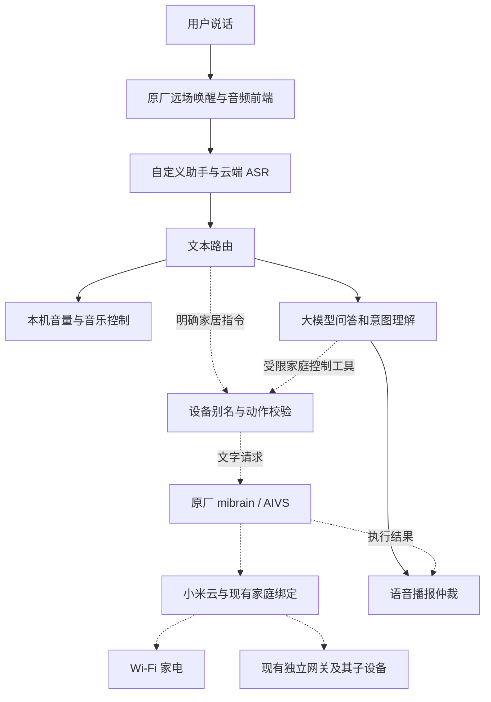

# L06A 现有能力盘点与大模型功能路线

调研日期：2026-09-30（Asia/Hong_Kong）  
状态：只读调研与产品规划；未实施新功能。

排期补充：后续周次、依赖与验收以 [下一阶段统一排期](L06A_NEXT_PHASE_SCHEDULE.md) 为准。长期记忆已提升为 P1，目标第 3 周首版、第 4 周观察；技术方案见 [长期记忆调研与排期](L06A_LONG_TERM_MEMORY_PLAN.md)。此补充不代表功能已实现。

本报告读取了自有 Go 助手代码、固件材料、原厂 ELF、设备变更记录和公开一手资料；在设备上仅列举了 `mibrain` 与 `miio` 的 UBus 接口定义，没有调用控制方法。没有开启麦克风、播放音频、控制家电、安装服务、修改代码或刷写。其他 Agent 持续开发，功能记录冻结到已读到的 **02:41 发布记录 final14**；后续变化须重新对照。

## 1. 用户目标与产品定位

用户确认：

- 保留日常音箱功能：语音、音乐、普通蓝牙、AUX、按键。
- **米家设备控制必须保留**，主要包括空气净化器等设备。
- 家里已经全部使用独立网关，不再依赖本音箱充当网关。
- **Home Assistant 不作为日常使用方案，也不作为下一阶段必需依赖。**

建议定位为：**能对话、能执行指令、能解释家庭状态的语音终端。** 保留可靠的原厂声学和米家基础，在上面增加大模型理解与受限工具执行。

这台 2019 年音箱仍有可利用的远场拾音、扬声器、按键和灯环。按已调查的 A113X/ARMv7、256 MiB 内存级别，不把现代通用大模型部署在音箱本机：仅 10 亿参数的 4-bit 权重理论上就约 500 MB，还不含缓存与运行时。模型运算继续放在云端，或用户以后选择的家庭计算设备；新功能不需要全部堆进固件。

## 2. 目前已经做到了什么

证据分为三类：**实机记录已验证**、**源码已实现但验收有限**、**原厂组件保留但未完成当前版本验收**。下面的“已实现”不等于所有边界条件已稳定。

| 功能 | 当前情况 | 依据与实际边界 |
|---|---|---|
| 小爱唤醒与远场语音入口 | 实机记录已验证 | 原厂 `mipns-xiaomi` 保留麦克风、AEC、波束成形和 VAD；助手从原生 socket 接收 16 kHz 单声道 PCM，避免第二次占用采集设备 |
| 云端语音识别 | 实机记录已验证 | 豆包流式 ASR 已接入；普通话问答闭环成功；`enable_lid=true` 已加入，发布记录载有用户确认方言问题解决，不代表所有方言/距离都已逐项测试 |
| 大模型问答 | 实机记录已验证 | 可配置兼容 `/chat/completions` 的服务和模型；可进行普通问答、解释等文本推理。故事、翻译等可复用该通道，尚无各类专项质量验收 |
| 短期上下文 | 源码已实现 | 内存历史，默认保留 12 条消息；不是 12 轮完整问答，也不是重启后仍在的长期记忆；没有家庭成员隔离 |
| 连续追问、结束对话 | 已有实机闭环与源码支持 | 默认等待 10 秒、最多 8 轮、会话最多 120 秒，可配置；退出词及 `end_conversation` 工具已接入 |
| 再唤醒打断当前回答 | 已实现，持续收口 | 通过新唤醒取消旧轮次并保护会话代际；不等于“无需唤醒、随时插话”的端到端全双工对话 |
| 语音播报 | 原厂 TTS 实机已验证 | 恢复 AIVS 运行组件，通过原厂 TTS 播报；“原厂 TTS”不等于离线 TTS。远程 TTS 适配代码存在，此前配置未启用 |
| 聚合点歌 | 实机记录已验证 | QQ 音乐、网易云、酷我搜索与候选合并，原唱/歌手排序、音质及来源回退；实际可播仍取决于音源和接口 |
| 当前歌曲、暂停/继续/切歌/停止 | 已实现，多项有实机记录 | 当前歌曲信息由助手内存状态维护；队列和进度并非完整持久媒体库，也不能保证反映外部蓝牙/原厂其他入口播放的内容 |
| 数字绝对音量设置 | 代码存在，需单独复核设备入口 | 有本地正则和工具参数；分析记录指出旧固件音量脚本与 data/overlay 版本存在差异，不能把“代码里有”视作当前语音链路全部正常 |
| 唤醒期间音乐压低、回答后继续 | final14 已发布并有底层验证 | 修复“音乐仍前进，却在回答后跳回唤醒点”：同一曲目继续播放时只恢复音量；真正暂停时原对象继续；完整现场语音体验仍待确认 |
| 聆听/思考/播报灯效 | 已实现并有 I/O 验证 | 聆听青色、思考 RGB 插值、播报原厂效果；40 FPS 更新已有测量，肉眼体验仍以现场反馈为准 |
| Web 管理 | 已实现并用于调试 | 配置、状态、日志、文字测试、朗读测试、模拟唤醒、配置重载；有管理令牌鉴权 |
| SSH 与助手网络更新 | 已实际使用 | 无需线刷即可更换 data 中的助手及控制脚本；受 data 容量限制，不等于完整固件 OTA |
| Wi-Fi 与启动修复 | 已进入现有固件/运行补丁 | DHCP、SSH 公钥和语音启动链有修复记录；下一版需统一固化 |
| 普通蓝牙、AUX、实体按键 | 原厂路径保留 | 属于必须保留的产品能力，但本次没有重新配对、插线或按键验收，不能标记为本轮全量验证通过 |
| 米家控制 | 原厂基础保留，**自定义助手尚未接通** | 当前工具列表没有家庭控制；已找到原厂文字执行入口，见第 4 节 |

主要依据：[设备发布记录](../build/DEVICE_CHANGE_LOG.md)、[语音与会话](../../assistant-agent/agent.go)、[ASR](../../assistant-agent/asr.go)、[LLM 工具定义](../../assistant-agent/llm.go)、[音乐实现](../../assistant-agent/music.go)、[TTS](../../assistant-agent/tts.go)、[播放与灯效根因记录](../research/PLAYBACK_LED_ROOT_CAUSE.md)。

### 2.1 两个容易高估的能力

**收到流式响应，不等于已经边生成边说。** 当前 LLM 客户端接收 SSE 后拼接完整文本，结束后再调用 TTS。分句流式播报、首句延迟优化和可靠取消仍是后续工作。

**模型会说，不等于系统会做。** 当前工具只有 `end_conversation`、`play_music`、`music_control`、`get_current_music`；路由仅处理返回的第一项工具调用。没有米家执行器、用户定时器、天气检索、网页搜索、日历或长期记忆工具，也没有通用的多步“调用工具—取得结果—再次推理”循环。

因此“十分钟后提醒我”“把净化器打开”“查一下实时空气质量”目前不能仅凭模型回答判定成功。原厂可能仍有相应历史能力，但自定义语音入口没有自动继承这些功能。

## 3. 未来最值得做的功能

优先级按用户当前需求和日常价值排序。下列为产品建议，不是已实现承诺。

| 优先级 | 能力 | 日常例子 | 需要补的实际机制 |
|---|---|---|---|
| P0 | 保留并接通米家基础控制 | “打开客厅净化器”“切到睡眠模式” | 原厂文字执行适配、设备别名与能力清单、结果判定、原厂/自定义播报仲裁 |
| P0 | 完整本机短指令 | “小声一点”“静音”“现在音量多少” | 本机受限动作、数字/中文数字/相对量解析、真实音量回读；修正部署脚本版本差异 |
| P0 | 固件和会话稳定性 | 重启后仍可用；问完问题音乐不回跳 | 固件收口、单一音频仲裁、发布清单、功能就绪检查和资源预算 |
| P1 | 定时器、提醒和闹钟 | “十五分钟后叫我关火”“每天七点提醒我” | 真正的持久任务、时区/校时、取消/查询、重启恢复、到期播报，不能用 LLM 口头承诺代替 |
| P1 | 更自然的米家表达 | “净化器有点吵，调安静些”“把它关掉” | 房间和设备指代、可执行动作校验、歧义追问；不能自动把“有点闷”解释成某项固定设备操作 |
| P1 | 家庭状态查询 | “净化器开着吗”“滤芯还剩多少”“客厅 PM2.5 多少” | 对应型号实际支持的属性、真实读取与时间戳；文字执行通道能否回传结构化数据尚待确认 |
| P1 | 减少对话等待 | 首句尽早播出；新唤醒立即中止旧回答 | 分句 TTS、播放队列、取消传播、回声与首字保护；先测当前分段时延再决定是否更换模型 |
| P1 | 实时信息 | 天气、新闻摘要、出行信息 | 可验证的数据接口/搜索工具、缓存有效期和来源；通用模型知识不能替代实时查询 |
| P2 | 按需家庭播报 | “晚间简报”；净化器任务结束提醒 | 事件来源、订阅、去重、时段/音量规则；现有 `/api/speak` 只是输出入口 |
| P1 | 持久偏好与家庭记忆 | 常听歌手、常用房间、喜欢简短回答 | 第 3 周交付有限结构化记忆；保存、查看、更正、删除和重启恢复；自动提炼后续验证 |
| P2 | 更完整的音频体验 | 播客、电台、有声内容、收藏和睡眠定时 | 内容来源、持久队列、进度、结束事件；当前搜索结果队列不能替代这些机制 |
| P2 | 语言练习、故事和资料问答 | 英语陪练、追问式故事、家电说明书问答 | 角色与任务状态；较大资料索引放可选后端，音箱只承担语音交互 |
| P2 | 现有米家场景联动 | “执行晚安场景” | 先验证原厂场景调用能力；复用用户已有米家自动化，避免另建相互冲突的调度系统 |
| P3 | 多意图与条件任务 | “净化器切自动模式，再放轻音乐” | 有界多步执行、逐项结果与失败处理；定时/条件动作必须实际注册并可取消 |
| P3 | 完整固件 OTA、更多离线降级 | 固件网络发布；网络异常时基础功能仍可用 | 专用升级恢复设计；离线识别/播报需独立评估，当前仅本地路由并不代表离线语音 |

第一批优先做“米家控制 + 本机短指令 + 稳定固件”，随后第 3 周交付长期记忆首版，再推进真正的提醒、真实状态查询和更低延迟。具体顺序以统一排期为准。

## 4. 不依赖 Home Assistant 的米家路线

### 4.1 已发现的本机证据

设备只读执行了接口列举：`ubus -v list mibrain` 和 `ubus -v list miio`。其中 `mibrain.ai_service` 当前已注册，参数包含：

| 字段 | 接口类型 | 能说明什么 |
|---|---|---|
| `nlp_text` | String | 有文字请求入口 |
| `nlp` | Integer | 存在 NLP 请求控制项 |
| `nlp_execute` | Integer | 存在执行控制项 |
| `tts`、`tts_play` | Integer | 有合成与播放相关控制项，实际行为待验证 |
| `asr`、`asr_audio` | Integer / String | 该综合接口也支持语音相关路径；后续文字桥接不得误触发收音 |

原厂 `miio_helper` ELF 在文件偏移 `0x1a27e` 有以下调用模板。这是从本地原始固件提取的证据，**本次未执行**：

```text
ubus -t 10 call mibrain ai_service '{"nlp_text":"%s","nlp":1,"nlp_execute":1,"tts":%d,"tts_play":%d}' &
```

同版原厂 `mico_aivs_lab` 中还可见 `MiotControllerInstructionHandle::OperateHandle` 与 NLP 请求处理符号。它们支持“复用原厂文字指令链路”的可行性判断，但字符串/符号和接口存在仍不足以证明当前账号、云端授权及具体净化器可执行。

公开 L06A MIoT v1 规格也定义了智能音箱的 `execute-text-directive` 动作（服务 5、动作 5），输入是文本和静默执行参数。规格描述不能替代本机固件实测，也不要照搬其他型号的参数类型；该 v1 的静默参数是枚举整数。[L06A MIoT 规格](https://miot-spec.org/miot-spec-v2/instance?type=urn:miot-spec-v2:device:speaker:0000A015:xiaomi-l06a:1)

### 4.2 推荐主线：自定义理解 + 原厂文字执行

建议的数据流如下，虚线表示需要新增的米家适配路径：



这是候选架构，不表示虚线部分已经联通；原厂通道究竟返回何种可用结果是原型阶段的重要问题。音箱的独立 Mesh 网关服务不在这条推荐控制路径的必要角色中，但组件依赖仍需停用验证。

对于明确的“打开客厅净化器”，可走快速规则；复杂表达交给模型转换成受限动作。建议未来工具形如 `home_control(device, action, value)`，先校验用户已登记的设备与其能力，再生成固定模板交给原厂；不要将任意模型输出直接拼入 shell。示例：“客厅净化器 / 模式 / 睡眠”只能在具体型号确有该模式时执行。

继续让原厂前端只向自定义 `speech.usock` 发送麦克风数据。**接通米家不要求把原始语音重新交还原厂云 ASR，也不应同时让两个助手完整处理同一段话。** 文字桥接使用独立、受控的 NLP 请求，与现有 TTS 共存关系要验证。

原厂服务可能自行播报、操作播放器或改变会话状态。原型阶段先确认它的实际反馈行为，再决定由原厂播报还是自定义助手播报；不能一开始关闭所有原厂反馈却又没有获取最终执行结果的能力。

### 4.3 不能混淆的三种成功

1. **接口接收成功：** 请求送达本机服务，不能直接回答“已经打开”。
2. **云端解析/下发成功：** 云端接受了动作，不一定代表离线设备已执行。
3. **设备状态确认：** 家电/米家 App 或可信状态接口显示目标状态，才能作为完成依据。

如果只获得第一种证据，应回答“指令已发送”，并说明暂未确认设备状态。家庭状态查询若无法经原厂通道可靠读取，就作为独立适配任务，不从聊天历史猜测 PM2.5、运行模式或滤芯寿命。

首个验收对象建议选一台实际净化器。先完成开/关和该型号支持的一个模式切换，再覆盖同名设备、离线、失败返回、用户取消和音乐共存。全部在以后明确安排的维护/功能测试中进行，本轮不发送这些指令。

### 4.4 其他路线的取舍

| 路线 | 适用情况 | 本项目决定 |
|---|---|---|
| 原厂文字执行桥接 | 保留已有小米账号和家庭控制，尽量少引入服务 | **优先验证**；关键入口已有本机证据，最终执行和反馈尚未验证 |
| 按具体家电做局域网 miIO/MIoT 适配 | 需要可靠状态读取或减少云依赖，且型号/协议支持 | 后备路线；需要确切型号、固件、IP 和授权材料，不保证所有米家设备都支持 |
| 独立小型家庭控制服务 | 原厂路径覆盖不了所需属性/自动化 | 可选，可放 NAS，但不运行 HA；不要为第一台净化器先搭一整套平台 |
| 官方云接口独立接入 | 有可用的应用资质、授权和接口范围 | 需核验实际接入资格；不是拿到用户账号就自动具备所有 API 权限 |
| Home Assistant + Xiaomi Home | 希望统一跨品牌家庭平台时 | 用户已不准备日常使用，因此不作为本次推荐或依赖 |

`python-miio` 是社区维护的 miIO/MIoT 实现，其文档说明支持设备可通过模型能力描述进行状态读取与控制，并需要相应连接信息；可作为后备适配的参考，不能据此认定未知型号兼容，也不计划把完整 Python 环境塞进音箱。[项目维护者文档](https://python-miio.readthedocs.io/en/latest/)

小米开放平台确有米家相关授权范围，但公开列出 scope 只证明存在权限分类，不能证明个人自制客户端已获准使用。[小米接口权限列表](https://dev.mi.com/xiaomihyperos/documentation/detail?pId=1518)

小米官方支持的 Xiaomi Home 集成证明存在官方家庭接入路径，但它依赖 HA，且其设备与本地控制覆盖有条件。此次仅作方案比较，未安装或启动。不要把该集成的授权方式直接当作任意自定义客户端可复用的接口许可。[小米官方项目](https://github.com/XiaoMi/ha_xiaomi_home)

## 5. 对固件裁剪方案的具体调整

**必须保留：** 原厂身份/账号授权、miio 通信、`mibrain_service`、需要的 AIVS 运行组件、原厂声学前端，以及基础音频/网络依赖。`libiotdcm.so` 与 `libaivs_bt.so` 已有其他核心使用证据，不能看到 IoT/BT 名字就删除。

**可列入第二批裁剪：** 音箱自身的 `mibt_mesh`、`central_lite` 和确属网关专用的配置/资源。用户已使用独立网关，为这一步提供了功能范围依据，但仍要先可回退停用，验证米家文字控制、授权刷新、普通蓝牙和重启，再从镜像删除。`miio_mpkg` 和 `mdnsd` 涉及更新/共享发现，需要独立判断。

**首先评估的空间项仍是：** 本硬件不用的 Realtek 路径和非当前提示音包；其压缩数据收益估算见[固件调查报告](L06A_FIRMWARE_REFACTOR_RESEARCH.md)。关闭原厂自动固件 OTA 要与米家控制保留分开实施，不关闭整套账号通信来达到禁更目的。

## 6. 把功能做成系统，需要的共用基础

### 6.1 单一会话与音频仲裁

唤醒、音乐压低、TTS、提醒、米家原厂回复、蓝牙和按键应共享一套明确的优先级和状态转换。尤其不能让 API 朗读、原厂 NLP 回复和主会话同时占用播放路径。已有音乐回跳问题说明“恢复”必须依据真实播放器状态，而不是仅凭助手内存推测。

### 6.2 通用但受限的工具执行层

把当前四个工具扩展成明确注册的动作集合；模型负责理解，执行层负责参数范围、设备能力、超时、取消和返回结果。多动作应逐项报告，不将部分成功包装为全部成功；对相同请求建立去重标识，避免网络重试导致重复定时或重复执行。

控制状态、天气数值、定时器是否创建等事实来自工具；缺少工具时如实说明。外部网页或检索内容不能自行触发家庭操作。这里需要的是有限、可验证的执行接口，不是给模型无限制设备 shell。

### 6.3 时间和持久状态

用户提醒与会话等待计时不同：前者要求任务持久化、时区与校时、重启/断电后的过期处理；后者只是当前进程内的等待。提醒、家庭别名和少量偏好可保留在有上限的 data 数据文件中；大型音频、网页缓存和资料库放外部或有上限的 tmp。

### 6.4 可判断的健康状态

保留 `/health` 作进程存活检查，另增加语音 socket、TTS、播放器、米家适配、剩余空间和配置版本的就绪状态。不要为了检查健康而自动开启麦克风或开关家电。提供功能验收结果和最近一次错误，避免“页面显示正常但不能做事”。

### 6.5 断网边界

当前云端 ASR、LLM 和原厂在线语音服务都可能需要网络。本地正则路由只减少大模型调用，不会自动带来离线语音。普通蓝牙/AUX/按键应继续作为基础能力；未来离线短指令需要单独的轻量识别方案与实机资源验证。

## 7. 建议分批实施与验收

以下保留调研时的功能分组与粗估，不再作为周次安排；新顺序以 [统一排期](L06A_NEXT_PHASE_SCHEDULE.md) 为准，估算不重复相加。其中持久偏好/记忆已从原 R4 提前为第 3 周必交首版。没有设置自动执行或立即实施；原厂接口和型号差异可能扩大范围。

| 批次 | 范围 | 估计 | 验收标准 |
|---|---|---:|---|
| R0 | 冻结可用版本，补齐保留功能基线 | 0.5–1 天 | 语音、音乐、蓝牙、AUX、按键的版本与结果明确；记录净化器型号、房间名和已有独立网关 |
| R1 | 一台净化器的原厂文字控制原型 | 1–2 天探索预算 | 开关与支持的模式能执行；能区分提交和执行结果；失败不假报成功；不干扰麦克风所有权 |
| R2 | 本机短指令与稳定固件收口 | 2–4 天，另安排维护观察 | 绝对/相对音量、静音、查询与播放控制有效；冷启动可恢复；米家路径和恢复槽保留 |
| R3 | 真正的定时器/提醒、状态查询、延迟优化 | 每项约 1–3 天起 | 定时任务可查可取消且重启不丢；状态来自真实设备；分段时延有测量 |
| R4 | 偏好、资料问答、主动播报、场景/多步骤 | 按需求逐项估算 | 每项均有输入、权限范围、持久策略、失败处理与实际结果 |
| R5 | 完整系统 OTA | 单独工程任务 | 沿用固件报告中的写入范围、断电恢复和实机验收要求 |

R1 若证明原厂通道无法可靠执行或无法满足用户所需状态查询，先记录具体限制，再按型号选择后备直连方式；不因此默认恢复 Home Assistant。不同批次的“1–3 天”不是整套产品全部完成的承诺。

## 8. 首个米家验收清单

- [ ] 记录净化器的确切型号、固件、米家家庭/房间和设备别名，不在报告中记录账号令牌。
- [ ] 确认米家 App 和现有独立网关工作正常，作为控制前后参照。
- [ ] 核对原厂文字通道的参数、授权、完成结果和播报行为；保留 speech socket 的单一所有权。
- [ ] 对一台设备验证开、关、支持的模式与真实状态；模式/数值范围以该型号规格为准。
- [ ] 测试设备离线、网络失败、同名设备歧义和不支持属性。
- [ ] 音乐播放时控制净化器，确保只播报一次，音乐不回跳。
- [ ] 可回退停用音箱 Mesh/网关服务后重复测试；确认普通蓝牙、账号刷新和重启均正常，才考虑裁剪。
- [ ] 查询不到传感器数据时明确说未获取，不把模型生成的数值当作读数。

## 9. 证据与可追溯信息

本轮代码核对的几个文件指纹如下。其他 Agent 可继续修改，指纹用于界定本报告观察对象，不阻止后续开发：

| 文件 | SHA-256 |
|---|---|
| `assistant-agent/llm.go` | `c4045099be6c1f6314e3d8708c6afe7c57415a9ec07e989d926599051296bd9f` |
| `assistant-agent/agent.go` | `3b6a0dcd0e53be802680574df67d467f06b23611f34925274971742e70e19d3a` |
| `assistant-agent/music.go` | `7002da46591d0bc4e56b3d50d0d7e89bcd840d48a1a4c1991050b9036c4c4f95` |
| 原始 `usr/bin/miio_helper` | `2780bb24bed5cfc3216f638ad074422d753d77a4715bdc7e36bd4008d2a9d5da` |
| 原始 `usr/bin/mibrain_service` | `617c000e79d5a1f38e0ceca7ab82587e6b26a079bd52697c59c436d8afcf2871` |
| 原始 `usr/bin/mico_aivs_lab` | `e7d03a1ddc5cd95caabfe6b87b0114236d2f54de07fd66b4e1f738252132f606` |

原始 ELF 位于 [original-system1-rootfs](../../local/analysis/L06A_1.88.221/original-system1-rootfs)。观察到的 UBus schema 与原始二进制字符串相互支持；没有调用 `ai_service`、`miot_rpc`、token 更新或任何注册/控制方法。

final14 的发布成功与底层音频验证引用[设备变更日志](../build/DEVICE_CHANGE_LOG.md)和[根因分析](../research/PLAYBACK_LED_ROOT_CAUSE.md)，不是本轮再次测试的结果。尚未验证的米家桥接、全双工、主动提醒、长期记忆和完整 OTA 均保持为规划项。
