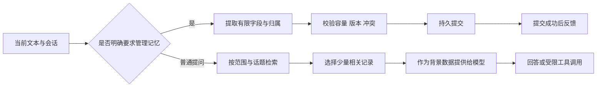

# L06A 长期记忆调研与实施排期

日期：2026-09-30（Asia/Hong_Kong）  
状态：方案与排期已编写；功能未实施、未启用。

本次只读核对源码和公开技术资料，仅写文档。未修改设备、程序、配置或用户数据，未把本次聊天内容导入音箱记忆。总排期以 [下一阶段统一排期](L06A_NEXT_PHASE_SCHEDULE.md) 为准。

## 1. 调研结论

**可以做，建议将轻量长期记忆提升为 P1，安排在存储和固件收口后的第 3 周交付首版。**

第一版使用现有 Go 程序维护少量结构化记忆，保存在 `/data`；支持“记住、查询、更正、忘记”，重启后仍可使用。初始只保存用户明确要求保存的非私密偏好与家庭称呼，不安装新的数据库服务，不依赖 Home Assistant，也不要求新增 NAS。

第二版在第一版经过正常使用观察后，再增加可选择开启的自动提炼和短事件摘要。大规模历史检索、个人私密记忆及跨设备同步单独排后续，不让第一版被复杂基础设施拖住。

长期记忆由应用保存和按需检索，不需要训练或修改大模型权重，也不靠无限增大聊天历史实现。LangChain 的记忆文档区分会话上下文与跨会话记忆，并列出了结构化资料、集合、同步/后台写入等实现取舍；本项目参考这些方法，不引入其完整框架。[记忆机制参考](https://docs.langchain.com/oss/python/concepts/memory)

## 2. 当前代码距离长期记忆还差什么

| 当前事实 | 对实现的影响 |
|---|---|
| `Agent.history` 是进程内的 `[]ChatMessage`，没有持久加载/保存 | 重启后丢失；单纯增加 `LLMMaxHistory` 无法解决 |
| 默认保留 12 条消息 | 是消息条数，不是 12 轮对话；历史也没有按字节或 token 预算管理 |
| 历史保存在单个 Agent，未见按用户隔离，也未在每次新唤醒时统一清空 | 不同使用者可能共享上下文；必须明确会话边界和记忆归属 |
| 音乐等快捷工具路径会提前返回，普通问答才追加历史 | 不能靠扫描现有 history 得到完整的偏好、动作或事件记录 |
| LLM 工具目前主要是音乐与退出；只处理第一项调用 | 要加入独立记忆执行器，并明确记忆动作与其他动作的顺序 |
| `atomicWrite` 只做临时文件写入、chmod 和 rename，未显式同步文件/目录 | 不直接将其当作已经验证的断电持久化实现 |
| ASR 结果会以 `recognized: ...` 记录；上一条回复也可能作为 ASR 上下文 | “不写记忆”不等于无日志；删除还需处理短期历史、状态和后续 ASR 上下文 |
| 既有 data 快照仅剩约 1.43–1.50 MiB | 不在当前紧张状态直接添加持久记忆，先完成容量治理 |

依据：[会话与历史](../../assistant-agent/agent.go)、[模型消息组装](../../assistant-agent/llm.go)、[配置与写文件](../../assistant-agent/config.go)、[ASR 上下文](../../assistant-agent/asr.go)。本轮未运行测试或重新测量设备容量。

## 3. 记什么、怎么用

| 类别 | 例子 | 保存方式 / 生命周期 | 排期 |
|---|---|---|---|
| 使用偏好 | 喜欢简短回答、常听某位歌手 | 明确保存，允许随时更正和删除；不默认过期 | M1 / 第 3 周 |
| 家庭称呼 | “小白”指客厅净化器 | 保存别名到已登记设备的映射；设备身份与支持动作仍由控制模块确认 | M1 / 第 3 周 |
| 默认选择 | 默认说“净化器”时指哪一台 | 用户明确指定后保存；不能越过实际型号能力校验 | M1 / 第 3 周 |
| 短事件摘要 | 某天用户明确记录“今天更换了滤芯” | 用户提供的事件注明来源和日期；初始最多保留 30 天，可固定保留 | M2 / 第 5 周候选 |
| 自动提炼的偏好候选 | 多次提到想听轻音乐 | 用户开启后在会话结束提炼；候选不立即当作已确认事实 | M2 / 第 5 周候选 |
| 实时设备状态 | 净化器是否开机、当前 PM2.5 | 由设备接口实时读取或短时缓存，不能当作长期事实 | 归米家状态模块 |
| 定时提醒 | “明天七点提醒我” | 进入独立任务调度器，记录执行时间、状态与取消方式 | 第 4 周；不靠记忆召回触发 |
| 密钥、账号凭据 | API Key、米家 token | 继续由凭据配置管理，不进入记忆或提示词 | 不纳入记忆 |
| 长篇录音/全文聊天/大型资料 | 所有历史语音、整本说明书 | 第一版不保存；将来需独立存储、检索和留存方案 | 后续候选 |

记忆只能改变偏好选择和提供背景，不能伪装成设备反馈。例如“喜欢睡眠模式”不代表净化器现在处于睡眠模式；“上周换滤芯”是用户记录，不等于传感器核验结果。

## 4. 存储路线比较与选型

| 方案 | 优点 | 代价 | 决定 |
|---|---|---|---|
| 有限 JSON 快照 + 内存索引 | 可直接用 Go 标准库；小体积，方便导出和审查 | 需实现单写者、版本、同步、容量和损坏处理 | **第一版推荐**，适合数百条低频更新 |
| SQLite | 事务、索引和筛选更成熟 | 需评估 ARM 构建、依赖/二进制增长、日志/临时空间和配置 | 后备方案，规模或写入复杂度上升再采用 |
| 本机向量检索 | 对不同表达的匹配有帮助 | embedding、索引和更新增加空间与延迟；无法自动解决事实冲突 | 不列入第一版 |
| NAS 上的小型记忆服务 | 容量充裕，方便资料库和同步 | 新增长期开机服务与网络依赖 | 可选后续，不要求 HA；基础语音和米家不能被它阻断 |
| 托管云记忆 | 本机存储少 | 额外账号、费用、网络和删除/导出边界 | 暂不作为默认方案 |

SQLite 本身可以很小，不能笼统认定不适合嵌入式；但默认行为需要预算。例如官方文档说明 WAL 常在约 1,000 页时触发自动 checkpoint，4 KiB 页时约 4 MiB，已经超过当前 data 余量。若后续采用，应显式限制数据库、journal/WAL、事务和临时空间，不能直接照搬服务器默认配置。[SQLite WAL](https://www.sqlite.org/wal.html)、[数据库容量限制](https://www.sqlite.org/limits.html)

**第一版不需要向量数据库。** 先按家庭/设备范围、偏好键、设备别名和关键词检索；若真实使用中的表达差异导致漏召回，再以相同样例比较语义检索收益。

## 5. 第一版数据与处理流程

### 5.1 记录结构

建议每条记录包括：`id`、`scope`、`kind`、`key`、`value`、`source`、`created_at`、`updated_at`、`expires_at` 和 `revision`。文件有独立 `schema_version` 与递增 generation。`source` 标明“用户明确要求”或“确认后的提炼”，不把模型自报的置信度当成事实保证。

相同 scope + key 的更正更新原记录，不无限追加。重复保存相同值直接返回已有结果，减少写入。设备别名指向控制模块登记的 ID，不能让模型编造 ID。原句只用于当前解析，首版不为追溯而永久保存完整录音或聊天。

### 5.2 保存和使用

“记住我喜欢简短回答”信息完整时直接保存，不做重复确认。称呼归属不清、语音识别歧义或与已有记录无法消解时再追问。保存失败不能先播报“记住了”。

检索建议最多 5 条、渲染后最多 2 KiB UTF-8 文本，另保留整体模型上下文预算。始终先过滤范围、过期和删除状态，再按主题、精确键与最近修改排序；无匹配就不注入。记忆作为有标签的背景数据，不提升为可覆盖程序规则或执行授权的系统指令。

本机命令和米家明确控制命令不必每次调用模型做记忆检索。模型或记忆模块失败时，基础控制继续工作。

### 5.3 家庭成员范围

首版定位为本机共同使用的非私密偏好和家庭称呼；不根据声音猜测成员身份，也不把“我是某某”当作认证。个人私密记忆的保存和朗读，留到有可信身份入口后再做。管理页的记忆读取、修改和导出沿用鉴权，不能成为公开 API。

将来增加个人 profile 时，家庭、设备和个人范围必须在查询前分开过滤，不能把所有人的资料一起发给模型再要求它自行区分。

## 6. 容量、性能与写入可靠性

### 6.1 初始预算（设计上限，尚未实测）

| 项目 | 首版建议上限 |
|---|---:|
| 活跃事实数量 | 200 条 |
| 单条完整序列化记录 | 1 KiB |
| 活跃快照 | 256 KiB，条数与字节双重限制 |
| 当前 + 待提交临时快照 | 合计最多 512 KiB |
| 少量元数据及不含正文的审计 | 64 KiB |
| 记忆模块持久写入峰值规划 | 不超过 1 MiB，包含额外临时项及文件系统余量预算 |
| 内存附加开销目标 | 不超过 2 MiB，以 ARM 实测为准 |
| 单次检索目标 | p95 不超过 20 ms，以 200 条混合中文样本实测 |

第一版不长期保留自动回退到旧内容的设备端历史副本；可按需导出到电脑。快照损坏时停止使用记忆并报告错误，音箱继续以无记忆模式工作；不能自动加载一个可能包含已删除信息的旧副本。将来增加冗余副本必须同时完成删除和恢复一致性设计。

采用保守门槛：固件/空间阶段验收后，空闲基线争取至少 4 MiB；每次写入仍按实际临时文件需求检查，并保留至少 2 MiB 运维余量。4 MiB 是项目预算目标，不是 UBIFS 的固定要求，也不能保证任何大小的助手更新都能安装。若达不到门槛，先做离线实现和测试，不在设备上开启持久记忆。

以上字节预算不把 UBIFS 压缩节省算作必得收益，也不包含未来向量索引、全文聊天或大批音频。

### 6.2 持久提交与恢复

建议使用单一写入队列，校验 schema 和预期 revision 后生成同目录临时快照，完整写入并同步文件，原子替换后同步父目录，再确认成功。临时文件与目标必须在同一文件系统。不能直接复制现有 `atomicWrite` 并把 rename 成功等同于断电保证。

Linux `fsync` 文档明确区分文件内容同步和目录项同步。实际硬件及 UBIFS 仍需受控恢复测试，文档中的流程不能替代验证。[Linux fsync](https://man7.org/linux/man-pages/man2/fsync.2.html)。SQLite 的原子提交文档也说明了同步与故障恢复之间的关系，可用作检查设计遗漏的参考。[SQLite 原子提交](https://www.sqlite.org/atomiccommit.html)

采集与音频线程不持有磁盘写锁。若提交中断、空间不足或并发更正失败，不返回保存成功；新请求不能被较旧异步提炼结果覆盖。统计命中次数等数据在内存中聚合，不为每次对话都重写快照。

### 6.3 模型调用和成本

M1 不需要 embedding 服务或每轮额外摘要请求；复杂“记住”表达可复用现有模型结构化工具调用，普通检索本地完成。额外成本主要来自被选入上下文的少量记忆。

举例：若每次实际增加 300 个输入 token，每日 30 次、每月 30 天，增量为 270,000 输入 token/月，再乘所选服务的输入单价。这里只是计算示例，不是假定中文字符数等于 token，也不是费用报价。M2 自动提炼的调用次数、延迟和费用单独记录。

## 7. 更正、遗忘和自动提炼

- “更正一下，我现在更喜欢……”更新同一项；明确的新事实优先，不能让后台旧摘要覆盖。
- “今天想听……”默认是临时意图，不改变长期偏好；“以后默认……”可作为明确保存请求。
- “忘记我的音乐偏好”删除对应持久记录，并清除相关短期历史、派生摘要和待处理提炼任务；首版可直接重置当前会话以避免立即重新带回旧事实。
- 忘记操作还应刷新 `LastTranscript` / `LastResponse` 等相关缓存和后续 ASR 提示上下文。未完成删除时如实报告，不假报成功。
- “关闭记忆”表示停止读取/写入；“清空记忆”表示删除。界面需明确两者差异，关闭后不能继续悄悄提炼。
- 当前日志可能记录识别正文。记忆模块的新日志仅记录操作、结果和脱敏 ID；临时/不记忆模式应覆盖语音日志路径。既有导出、旧日志、闪存残留或外部服务记录不能承诺因一次“忘记”就完成物理擦除；文档和界面应说明删除的实际范围。

M2 默认由用户选择开启，在会话结束后至多提炼一次，合并候选、限制频率；先建议保存，不把推测直接当作永久事实。明确拒绝、纠正或删除会取消相关旧任务，避免下一轮又自动记回。候选过期、低价值事件自然淘汰，用户明确保存的事实不能静默挤掉。

事件摘要只总结用户陈述或已经确认的工具结果；不能从“助手说已经开机”推导出设备真的开机。长期记忆也不能替代米家设备状态回读。

## 8. 实施排期

第 1 周从项目获得可用维护窗口后计算，不是从本报告日期自动开始。首版前置条件是第 2 周的容量与固件门槛；只有一名实施者，下面各项工作量不与总排期重复相加。

| 编号 | 时间 | 内容 | 预计投入 | 交付物 |
|---|---|---|---:|---|
| M0 | 第 2 周发布验收时 | 确认空间、范围和统一工具接口 | 纳入基础阶段验收 | 存储门槛、schema 与接口约定 |
| M1.1 | 第 3 周 D11 | 记录模型、显式保存/查询、更正规则 | 1 天 | 有限记忆接口和合成样本 |
| M1.2 | 第 3 周 D12 | 快照、同步提交、版本和容量控制 | 1 天 | 重启/错误恢复路径 |
| M1.3 | 第 3 周 D13 | 按话题检索、模型背景注入、范围隔离 | 1 天 | 可跨会话召回的闭环 |
| M1.4 | 第 3 周 D14 | 忘记、清空/开关、鉴权管理页和导出 | 1 天 | 用户可管理的记忆功能 |
| M1.5 | 第 3 周 D15 | 回归、ARM 资源与故障验证、候选发布 | 1 天 | 首版验收记录 |
| M1 观察 | 第 4 周 | 正常使用至少 7 个日历日 | 不等于 7 个额外开发日 | 误记、漏记、写入增长、响应延迟记录 |
| M2 探索 | 第 5 周 D21–D22 | 自动提炼候选、短事件摘要、过期与冲突 | 最多 2 天原型预算 | 可行性结果；满足首版门槛才进入灰度 |
| M2 验收 | 第 6 周缓冲中有余量时 | 对话样本、延迟与误记验证 | 视结果 | 未通过则维持 M1，M2 顺延 |
| M3 | 后续独立排期 | 私人身份、跨设备、向量检索/大型历史 | 待定 | 不阻塞 M1/M2 |

若第 3 周实际需要超过 5 天，优先顺延第 4/5 周扩展，不能删掉“更正/删除、持久性、容量”来赶进度。M1 的“记住”只有在持久提交成功后才算完成。

## 9. 验收标准与退出条件

离线使用合成数据构建 40 条基础用例，按以下五组各 8 条：跨会话召回、更新/冲突、范围/歧义、无依据拒答、容量/恢复。确定性存储与权限边界必须全过；20 条自然表达核心样例目标至少 18 条正确处理，但“串用户、删除后回流、失败假报成功”任一出现都阻止发布。数字是本项目目标，尚无实测结果。

重点检查：

- [ ] 进程重启和正常断电重启后，已确认记忆仍可查询。
- [ ] 修改后只使用新值；重复请求不生成重复记录。
- [ ] 忘记后经新会话、重启、后台任务完成，旧事实均不被召回。
- [ ] 他人称呼、未知归属及未登记设备不导致错误串用或设备操作。
- [ ] 文件损坏、磁盘不足、写入中断时基础音箱仍可用，保存结果如实报告。
- [ ] 注入超长文本、非法字段或指令性内容不会改变执行权限或填满分区。
- [ ] 200 条上限下满足资源目标；连续 7 天无逐轮正文日志/临时文件积累。
- [ ] 固件回退不会静默覆盖新 schema；不兼容时禁用记忆并保留可导出数据。

先在电脑/仿真环境验证写入故障，不通过填满真实 data 来测试。实机重启、断电恢复与语音操作仅在后续维护窗口进行。

长期记忆的评估要覆盖更新、跨会话、时间和不知道答案时的处理；不能只测“保存一条后马上问”。研究基准 LongMemEval 可作为测试维度参考，本项目不直接宣称达到其公开成绩，也不必为首版部署完整基准框架。[LongMemEval 论文](https://arxiv.org/abs/2410.10813)

## 10. 依据与待定事项

本轮核对的 `agent.go` SHA-256 为 `3b6a0dcd0e53be802680574df67d467f06b23611f34925274971742e70e19d3a`，`config.go` 为 `14420636f7cb9d6f36b887b24b93c7d40a93a85a55b84e9d2637fcaa1f9998f0`。其他 Agent 可继续修改；实施前重读，不依赖旧行号或认为源码已冻结。

待实施时确认：维护启动日期、最新空闲空间、净化器具体型号与别名、实际模型是否支持可靠工具调用、是否启用 M2。暂按本机家庭共享非私密记忆设计；不因这些可后定事项阻塞当前文档排期。

相关文档：[统一排期](L06A_NEXT_PHASE_SCHEDULE.md)、[功能路线](L06A_CAPABILITY_ROADMAP.md)、[固件重构调查](L06A_FIRMWARE_REFACTOR_RESEARCH.md)、[data 优化执行细项](DATA_PARTITION_OPTIMIZATION_PLAN.md)。
